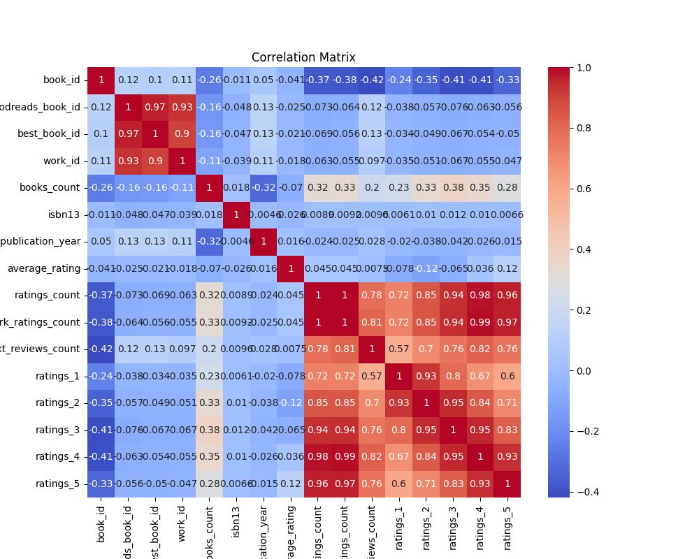

# Automated Data Analysis

### Story of Data Analysis: Exploring a Library of 10,000 Books

In the heart of a bustling city library, a rich tapestry of literature awaited eager readers. The digital archives grew with every passing day, housing a fascinating dataset of 10,000 books, each a portal to another world. As a data analyst, I took on the adventure of analyzing this vast collection. My goal was to derive meaning and insights from a sea of numbers and titles, filling gaps of knowledge and enhancing the library's offerings.

#### The Dataset: An Overview

As I delved into the dataset, I discovered key identifiers for each book: book ID, goodreads book ID, best book ID, work ID, and more. The completeness of these fields was clear as all 10,000 entries maintained consistent counts. This first step painted a picture of diversity and depth within the library.

Through summary statistics, I explored the data's domains, illuminating vital characteristics of this literary treasure trove.

#### The Distribution of Book IDs

The **book_id** ranged from 1 to 10,000, forming a central value around 5000.5. The relatively high standard deviation of approximately 2886.90 pointed to a wide distribution, where countless stories lay in wait, spread throughout the catalog.

#### A Diverse Collection of Authors

As I sifted through the authors, a captivating detail emerged: the dataset boasted **4,664 unique authors**. Atop this mountain of creativity stood **Stephen King**, the prolific wordsmith who penned **60 titles** in this collection. His towering presence illustrated the library's depth in contemporary fiction, yet it beckoned the question of what other voices lay at the fringes.

#### The Temporal Landscape of Literature

Amidst the excitement of discovering authors, the **original_publication_year** revealed an intriguing historical depth. The average publication year encapsulated 1982, with records reaching all the way back to 1750. This span indicated a rich mix of classic and contemporary works, ensuring that readers could traverse the annals of literary history and modern storytelling alike.

#### Ratings Analysis: A Snapshot of Reception

The books received an average rating of **4.00**, peaking at **4.82** — a testament to the generally favorable reception within this library. Yet, the **ratings_count** unveiled an interesting disparity: while the average stood at **54,001**, the top-rated titles amassed ratings nearing **4,780,653**. This variance hinted at the phenomenon of a few outstanding pieces capturing audiences while others wandered under the radar.

Digging deeper into the five-star ratings, I found that readers were notably generous. The books averaged **23,790** individual five-star ratings, with the highest boasting **3,011,543**. The patterns of these ratings painted an encouraging picture: a community responsive to quality literature.

#### Uncovering Correlations for Deeper Insights

One of the most riveting findings lay in the correlations between various metrics. I constructed a correlation matrix that visually represented the relationships among rating metrics and author productivity. To my surprise, there existed a moderate negative correlation between **books_count** and ratings-related metrics.

This insight suggested that the more books an author produced, the less favorably their works were rated on average. It painted a cautionary tale for authors: it may be beneficial to focus on quality over quantity. Alternatively, this could imply that a saturation of an author's work could frustrate readers, diluting their engagement.

Furthermore, the positive correlation across ratings showed a parallel: high performance in one rating category frequently occurred alongside high evaluations in others. This synchronous achievement highlighted the patterns in reader behavior, hinting at a desire for consistency in quality.

#### Implications and Recommendations

After mining through the data, actionable recommendations surfaced:

1. **Highlight Diverse Authors**: Given the broad range of authors, the library should create thematic collections or events that feature a variety of lesser-known authors alongside celebrated names like Stephen King. Promoting emerging voices can enrich the community’s reading experience.

2. **Curate Historical Selections**: With literature spanning centuries, promotional campaigns should emphasize classic literature as well as contemporary works. Curating themes around historical movements in literature could intrigue readers of all ages.

3. **Encourage Quality Over Quantity**: For emerging authors or those seeking to publish anew, it may be advantageous to focus on crafting fewer, quality works rather than flooding the market. This can foster lasting engagements and positive reception.

4. **Community Engagement**: Building a community review system could capture reader feedback more dynamically, allowing the library to stay aware of trends and preferences, ensuring that collections continuously align with attendee interests.

As I concluded my analysis, I prepared visual representations of my findings: a **correlation matrix** and insights about **missing values**. These visual tools would aid library staff and stakeholders, ensuring that the data birthed actionable insights that would enhance the reader experience.

## Correlation Matrix

## Missing Values

