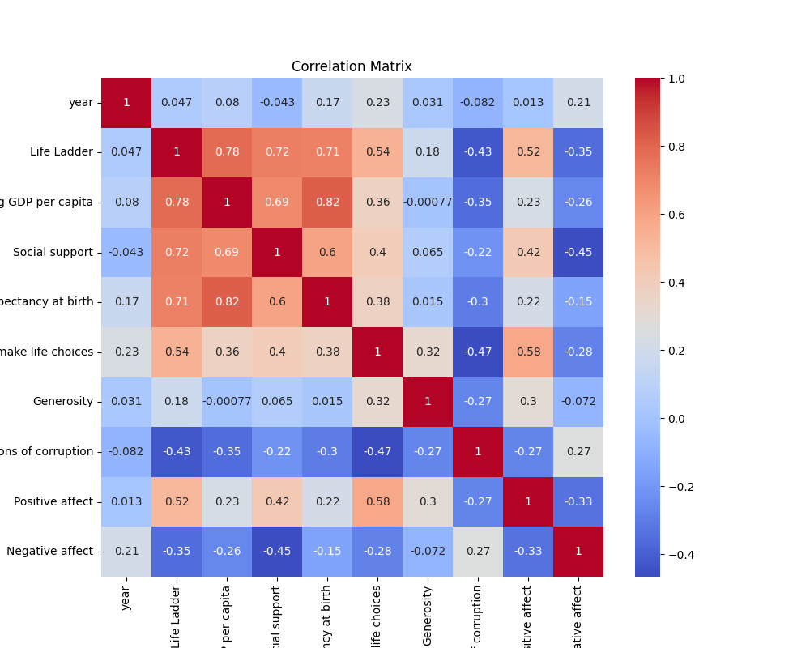
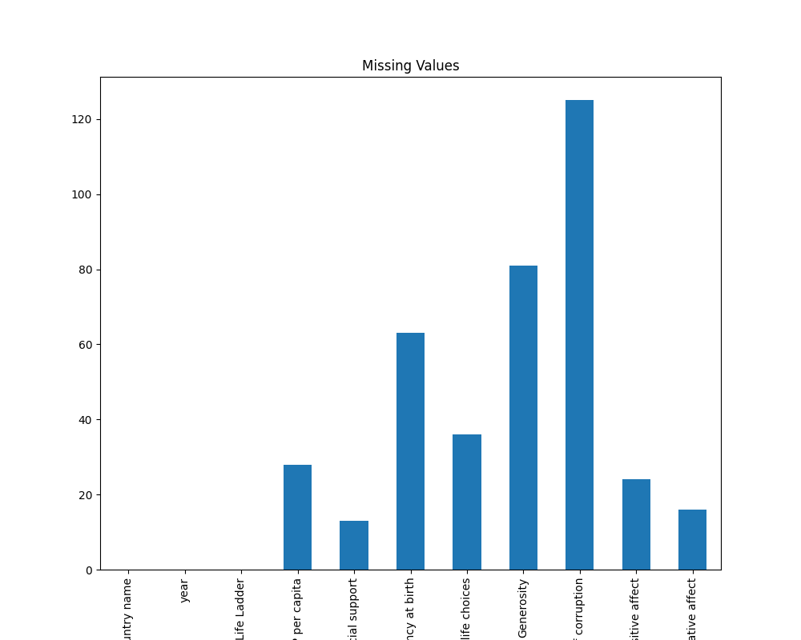

# Automated Data Analysis

### A Story of Data Insights: Understanding Well-Being and Economic Performance

In the midst of an ever-evolving global landscape, a robust dataset encompassing 2,363 observations from 165 unique countries was laid before the watchful eyes of data analysts. This dataset, while rich in its scope, offered an intriguing exploration into the realms of human well-being, economic performance, and social conditions over nearly two decades from 2005 to 2023. 

#### Unveiling the Stories Behind the Numbers

#### Data Overview
The meticulous analysis began, revealing that Lebanon was the most prominently represented country, surfacing 18 times within the dataset. Such a frequency marked it not just as a data point, but as a potential case study for further exploration. 

From the temporal lens, the data bore witness to the changing tides of the world, with an average year pegged at approximately 2015—a period often considered pivotal for many regions. The narrative held the promise of understanding how life satisfaction, economic resilience, and social structures interacted through the years.

*Correlation Matrix demonstrating relationships between key metrics*

#### Key Metrics 

#### Quality of Life Indicators
Among the findings, life satisfaction, measured through the Life Ladder, stood at an average of 5.48 on a scale likely ranging from 0 to 10. Such a mean indicates that while many citizens across the globe enjoy a moderate sense of contentment, room for improvement remains substantial. Furthermore, Healthy Life Expectancy averaged around 63.4 years. This statistic, underscoring the considerable disparity in health outcomes, beckons the urgent need for health policies that can bridge this gap, especially in countries at the lower end of the spectrum.

The sense of social support—a critical piece of the well-being puzzle—registered an encouraging mean of 0.809. This suggests that despite global challenges, individuals largely feel supported by their communities. 

#### Economic Indicators
Delving deep into economic indicators, the Log GDP per Capita emerged with an average of 9.40, revealing that the dataset predominantly reflects wealthier nations. The strong correlation (0.784) between Log GDP per Capita and Life Ladder further accentuated an important narrative: wealthier nations often correlate with higher life satisfaction.

Navigating through the nuances, the analysis revealed the score for "Freedom to make life choices," resting at 0.75. This metric illustrates relatively high personal agency among individuals regarding their decision-making processes, illuminating a hopeful sign for democratic and liberal values across nations.

#### Generosity and Perceptions of Corruption
However, not all indicators painted a rosy picture; generosity levels emerged as quite low, averaging nearly zero, suggesting that nations tended not to engage heavily in altruistic behaviors. This ambivalence coincided with a striking finding: a negative correlation (-0.430) existed between Life Ladder scores and Perceptions of Corruption. Such a connection suggests that individuals in countries characterized by higher corruption levels tend to report decreased life satisfaction, unveiling a vital lesson regarding the importance of transparent governance and social justice.

#### Emotional Indicators
The analysis transcended into the realms of emotional well-being, where positive affect averaged at 0.652, signaling general positivity among individuals, while negative affect averaged at 0.273. This careful balance of emotions reveals a nuanced undercurrent of human experience, allowing for further dialogues about mental health and emotional resiliency in various socio-cultural contexts.

### Implications and Actions

From this analysis emerged a call for action. Policymakers and social leaders must take heed of the linkage between wealth and life satisfaction; fostering economic growth should remain a priority, but economic policies should also encourage social support systems and transparency to combat corruption. Regions struggling with low life satisfaction scores must capitalize on investments in health and well-being initiatives, ensuring that every individual can lead a fulfilling life.

#### Next Steps
In order to further deepen these insights, a thorough examination of the missing values within the dataset was essential, as depicted in the accompanying visualization. Continuous monitoring and updating of this data would allow for tracking improvements over time, enabling countries to learn from each other’s successes and challenges.

*Missing Values that need addressing for richer data insights*

In conclusion, the unfolding story derived from this dataset underscores the intricate connections woven between economic prosperity, social supports, and individual life satisfaction across diverse countries. As with any story, the data does not simply reveal; it raises questions and calls for introspection, inviting active engagement towards creating a more fulfilling world for all.

## Correlation Matrix

## Missing Values

