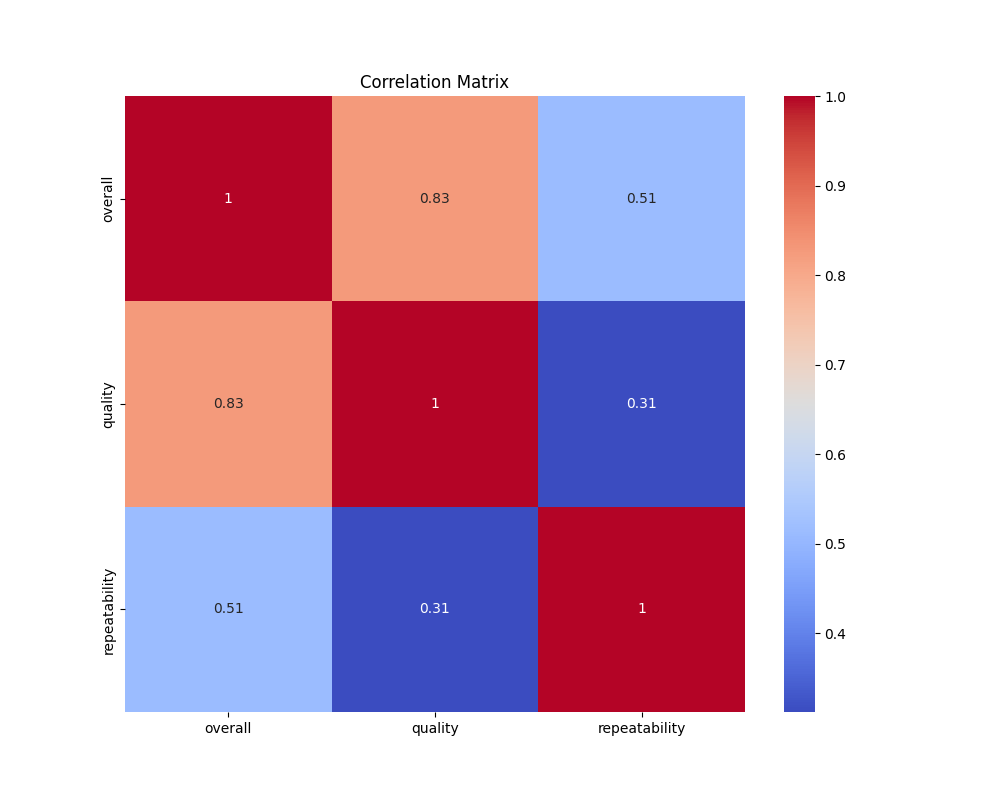
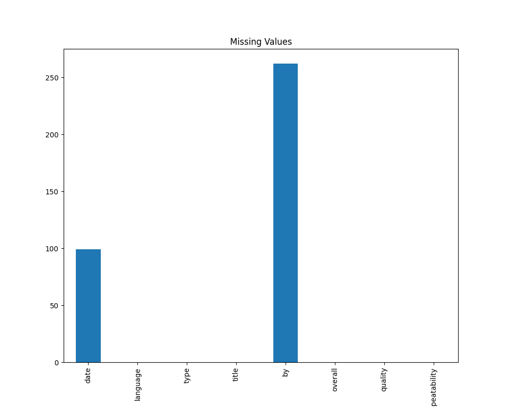

# Automated Data Analysis

### The Story of Data Insights: Film and Ratings Exploration

Once upon a time, in the realm of data analytics, a curious team of analysts received a rich dataset brimming with insights about films. This data comprised various attributes, including dates, languages, movie types, titles, contributors, and ratings. Intrigued by the wealth of information, the team decided to dive deep into the analysis, envisioning the stories hidden within the numbers.

#### The Data Journey Begins

At first glance, the dataset revealed a total of **2,652 entries**, but it didn’t take long for the analysts to notice nuances within it. They observed that while many columns were complete, some suffered from missing values: **99 entries** were missing in the **date** column and **262 entries** in the **by** column. This realization sparked a giant red flag—filling the gaps could potentially enhance the narrative they were striving to uncover.

#### Unearthing Time with Dates

Moving forward, the team dissected the dates in the dataset. Amongst the **2,553 recorded dates**, they identified a remarkable high concentration of entries on **21-May-06**, which appeared **8 times**. This peculiar date evoked curiosity—what significance did it hold? It hinted at a possible event, release, or trend that captivated the attention of viewers or contributors during that time.

#### Speaking the Global Language

Soon after, the analysts turned their focus to the **language** feature. To their delight, they discovered that English reigned supreme, accounting for **1,306 entries**. The 10 other languages blended together, painting a picture of a dataset primarily crafted for an English-speaking audience. There was something both familiar and restrictive about this—a stark emphasis that could either invite a wider audience or alienate non-English speakers.

#### Dominance of the Movie Genre

In a thrilling twist, the analysis illuminated that **movies** dominated the entries—**2,211**, to be precise. The analysts relished the implications of this observation: they were dissecting a dataset predominantly about entertainment, reflecting societal tastes and trends in cinematic experiences.

#### The Quest for Popular Titles

As they explored the **titles**, they found an impressive array of **2,312 unique names**, with **'Kanda Naal Mudhal'** claiming the spotlight as the most frequently recorded title. With **9 mentions**, it raised questions about its popularity—could it be a cult classic, or did it resonate with particular audiences? The analysts were motivated to dig deeper into what made this title so special.

#### The Contributors’ Chronicles

The team couldn't overlook the contributors, spotlighting **Kiefer Sutherland** as the leading contributor with **48 entries**. His presence hinted at a significant influence within the dataset. This finding led the analysts to ponder the impact of prolific contributors on the thematic essence of the entries.

#### Ratings: A Double-Edged Sword

The story became even more interesting with the exploration of rating metrics. The **overall rating** averaged **3.05**—a moderate satisfaction level among viewers. The **quality rating** fared a tad better at **3.21**, suggesting that while there is a decent appreciation for the films, there is room for improvement.

A deeper analysis of **repeatability ratings** revealed an average of **1.49**. This indicated that while certain films enjoyed occasional repeat views, many were likely dismissed, calling attention to how engagement fluctuated with individual titles. 

#### Implications and Action Steps

Armed with these insights, the data analysts contemplated actions to consider:

1. **Focus on Missing Values**: Addressing the missing entries could present a clearer picture. Perhaps leveraging techniques like data imputation or gathering further contributions could enrich the dataset.

2. **Expand Language Options**: Considering the predominance of English, exploring and enhancing multilingual offerings could captivate a wider audience, making the treasure trove of films accessible to global viewers.

3. **Investigate Audience Trends**: Understanding the spikes in entries regarding specific dates like **21-May-06** could uncover why certain films captured the public’s attention, thus guiding future content strategies.

4. **Engage Thriving Contributors**: Recognizing and nurturing contributors like **Kiefer Sutherland** could lead to strategic partnerships, fostering more enduring relationships around content creation and curation.

5. **Enhance Quality Measures**: The average ratings hint at potential dissatisfaction. Instituting feedback loops post-viewing or improving marketing strategies could help enhance viewer engagement and interest.

#### Conclusion 

The analysts embarked on their journey, excited by the prospect of uncovering richer, multifaceted narratives from the dataset. As the story progressed, they envisioned a future where data-driven decisions led to a more vibrant, engaging cinematic experience for all viewers. Their work was more than mere statistics; it was an odyssey into the heart of film culture—a fusion of analytics and artistry. 

### Visual Narratives

## Correlation Matrix

## Missing Values

